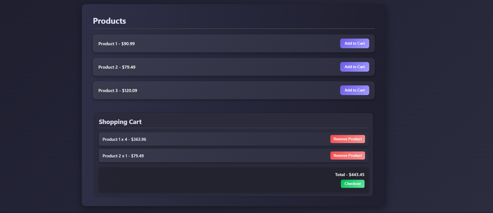

# 🛒 Ecommerce Cart Web App

A simple and elegant shopping cart built using **HTML**, **CSS**, and **JavaScript**. This web app allows users to:

- View a list of products
- Add items to a shopping cart
- Track quantity of each product (e.g. `Product 1 x 3`)
- View running total of the cart
- Remove items or reduce quantity
- Checkout with a thank-you message
- Persist cart state using `localStorage`

---

## 🔗 Live Demo

👉 [Check it out here](https://swaraj-unde.github.io/Ecommerce-Cart/)

---

## 📸 Preview

---

## 🚀 Features

- ✅ Add products to cart
- ✅ Show quantity instead of repeated items
- ✅ Remove one unit or the entire product
- ✅ Calculate and display total cost
- ✅ Checkout clears cart with a success alert
- ✅ Responsive layout for mobile and desktop
- ✅ Data persists via `localStorage`

---

## 🧩 Tech Stack

- **HTML5** - Structure
- **CSS3** - Styling & Responsive Design
- **Vanilla JavaScript** - Logic & DOM Manipulation

---

## 📜 License

This project is open-source and free to use. No attribution required, but appreciated 😊

---

## 💬 Feedback

Feel free to raise issues or suggest improvements. If you liked this, star the repo ⭐ and share!

---
